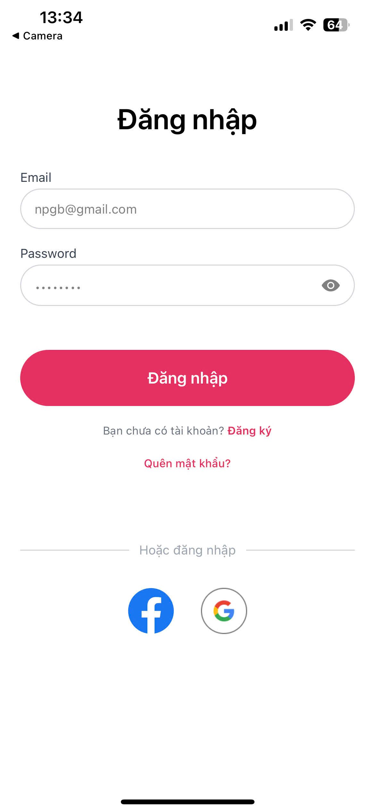
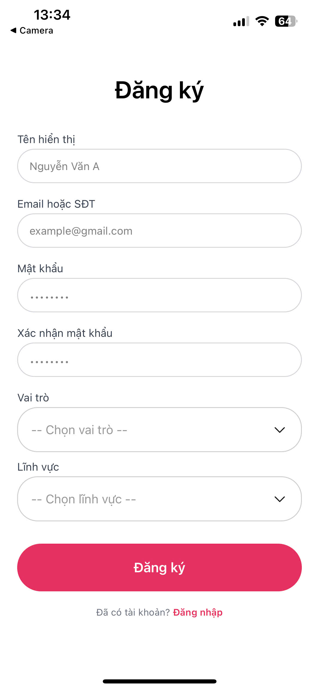
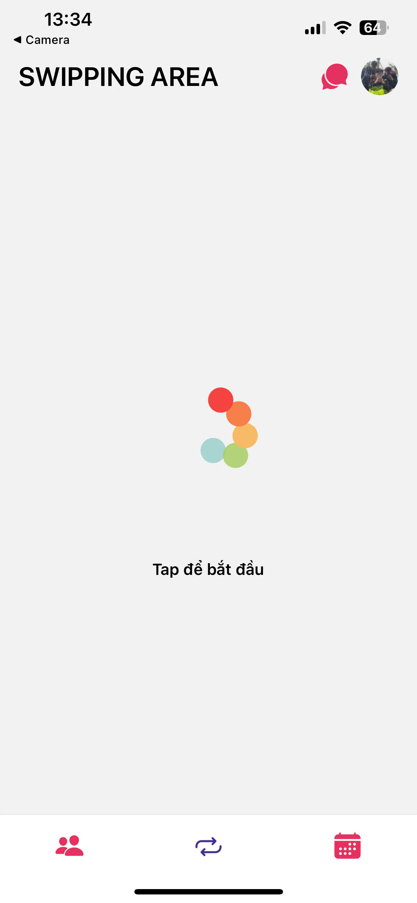
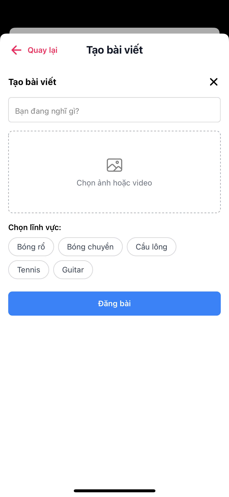
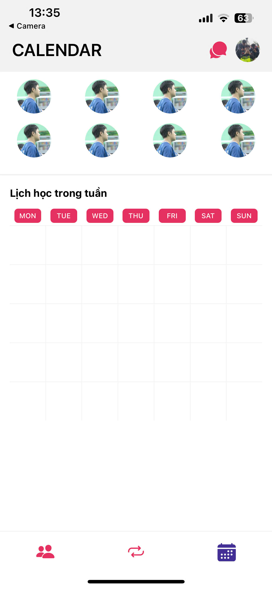
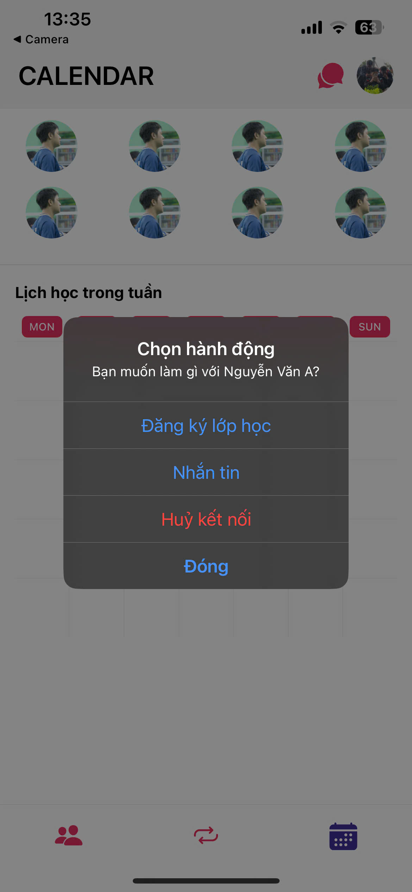
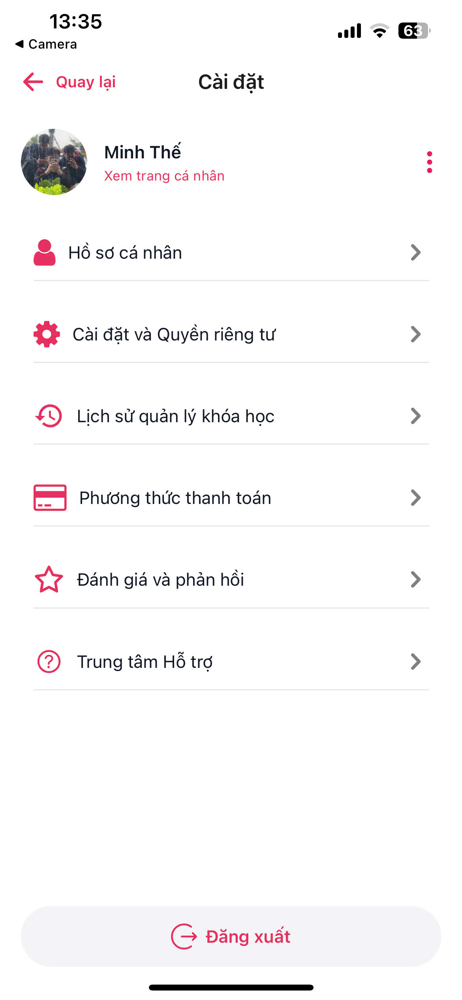
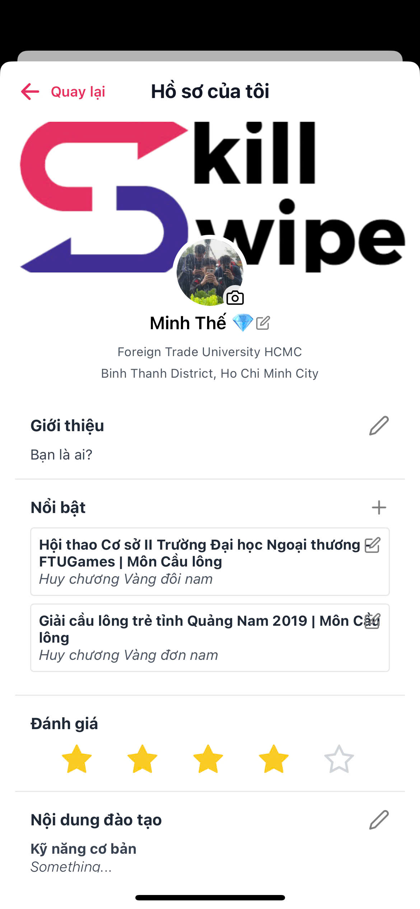
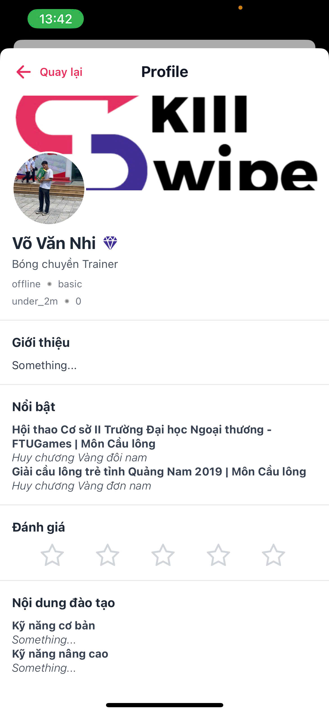

# Skillswipe

**Skillswipe** is a mobile app built with **React Native** using **Expo**, built for a team of **Foreign Trade University (FTU)** students participating in a competition in Ho Chi Minh City. The app connects **learners** and **mentors** to develop skills, while also providing a platform for **skills trading**—where users can trade their skills in a Tinder-style matchmaking interface.

## 🚀 Features

Skillswipe aims to create a dynamic, interactive platform where:
- **Trainees** can find **Trainers** to learn new skills.
- In the future, users with complementary skill needs will be able to **swap knowledge** (e.g., one teaches design, the other teaches coding).
- Matching is based on mutual interest, and chatting is only available after a successful match.

## 🔧 Tech Stack

- **Frontend**: React Native (with [Expo](https://expo.dev/))
- **Backend**: Firebase (Authentication, Firestore, Realtime Database)
- **Media Storage**: Cloudinary (for profile pictures and post images)
- **Others**: 
  - Firebase Cloud Messaging (for notifications, planned)
  - Expo Router, AsyncStorage, etc.

## ✨ Current Features

### 🧭 Trainee to Trainer Matching
- Swipe interface similar to Tinder
- Match logic and mutual chat access

### 💬 Messaging (Coming Soon)
- One-on-one chat after matching (under development)

### 📄 Trainer Profiles
- View detailed information about trainers
- Browse skills, bios, and other info

### 🧑‍💻 Profile Management
- Edit personal information
- Add skills you want to teach or learn

### 🌐 Community Tab
- Post articles, questions, and updates
- Like and comment on posts

### 📅 Schedule Booking (Coming Soon)
- Book training sessions with trainers
- Calendar integration under development

### 🔁 Skill Swap (Coming Soon)
- Users can both train and be trained
- Mutual exchange logic in progress

## 📦 Installation

```bash
git clone https://github.com/leeminhhthee/skillswipe.git
cd skillswipe
yarn
npx expo start
```

With run in different network:
```bash
npx expo start --tunnel
```

## 🤝 Contributors

This project is developed by a group of students from **Foreign Trade University (FTU)** as part of a team-based learning initiative.

## 🖼️ Screenshots

|  |  |  |
|-----------|------------|--------------|
|  |  |  |
|  |  |  |
|  |  | |

[▶️ Watch Demo 1](https://res.cloudinary.com/dikzmjuff/video/upload/v1749626036/VD1_ovrlgu.mp4)
[▶️ Watch Demo 2](https://res.cloudinary.com/dikzmjuff/video/upload/v1749626002/VD2_tn1gru.mp4)
